────────────────────────────────────────────────────────
# PENUMBRA TECHNICAL SPECIFICATION
## Unified Commerce Infrastructure v2.0
────────────────────────────────────────────────────────

**Document Version**: 1.0  
**Date**: September 15, 2025  
**Classification**: Technical Architecture Document

## Executive Summary

Penumbra is a revolutionary **O(1) scaling commerce infrastructure** that enables AI assistants to interact with unlimited services through a constant set of meta-tools. The system combines three architectural layers:

1. **Unified API Gateway** - Central authentication and service routing hub
2. **Metatool MCP** - Dynamic service discovery with 5 constant meta-tools
3. **Penumbra Backend/Frontend** - AI-powered chat interface with Claude integration

The architecture solves the critical **tool explosion problem** where traditional approaches require N×M tools (50 services × 20 tools = 1,000+ tools), causing context window exhaustion and $0.50+ per message costs. Instead, Penumbra provides **infinite service scalability** with just 5 meta-tools.

## Table of Contents

1. [System Architecture](#1-system-architecture)
2. [Component Deep Dive](#2-component-deep-dive)
3. [Provider System](#3-provider-system)
4. [Billing & Commerce](#4-billing--commerce)
5. [Service Discovery](#5-service-discovery)
6. [Deployment Architecture](#6-deployment-architecture)
7. [Security Model](#7-security-model)
8. [Maintenance & Operations](#8-maintenance--operations)
9. [Growth Strategy](#9-growth-strategy)
10. [Technical Roadmap](#10-technical-roadmap)

────────────────────────────────────────────────────────
## 1. SYSTEM ARCHITECTURE
────────────────────────────────────────────────────────

### 1.1 High-Level Data Flow

```mermaid
graph TB
    subgraph "User Layer"
        USER["End User"]
        CURSOR["Cursor IDE"]
        CLAUDE["Claude Desktop"]
    end
    
    subgraph "Frontend Layer"
        WEB["Penumbra Web App<br/>(Next.js + Supabase)"]
    end
    
    subgraph "AI Processing Layer"
        BACKEND["Penumbra Backend<br/>(Modal + FastAPI)<br/>• SSE Streaming<br/>• Token Management<br/>• MCP Orchestration"]
    end
    
    subgraph "Service Discovery Layer"
        METATOOL["Metatool MCP<br/>(5 Meta-Tools)<br/>• search_services<br/>• list_tools<br/>• execute<br/>• get_started<br/>• health"]
    end
    
    subgraph "Gateway Layer"
        UNIFIED["Unified API Gateway<br/>(FastAPI + Modal)<br/>• Authentication<br/>• Billing<br/>• Service Registry<br/>• OpenAPI Aggregation"]
    end
    
    subgraph "Provider Layer"
        PROVIDERS["Provider Plugins<br/>• DoorDash<br/>• Uber<br/>• OpenTable<br/>• Sephora<br/>• ESPN<br/>• LinkedIn<br/>• ...∞ services"]
    end
    
    subgraph "External APIs"
        APIS["Upstream Services<br/>• REST APIs<br/>• GraphQL<br/>• WebSockets"]
    end
    
    USER --> WEB
    USER --> CURSOR
    USER --> CLAUDE
    
    WEB --> BACKEND
    CURSOR --> METATOOL
    CLAUDE --> METATOOL
    
    BACKEND --> METATOOL
    METATOOL --> UNIFIED
    UNIFIED --> PROVIDERS
    PROVIDERS --> APIS
    
    style METATOOL fill:#ffd700,stroke:#ff6b6b,stroke-width:4px
    style UNIFIED fill:#e3f2fd,stroke:#1976d2,stroke-width:3px
```



### 1.2 Core Design Principles

#### **O(1) Tool Scaling**
- Traditional: 1,000+ individual tools exposed to LLM
- Penumbra: 5 constant meta-tools regardless of backend services
- Result: Infinite service scalability without context explosion

#### **Progressive Disclosure**
```python
class AuthenticationLevels:
    ANONYMOUS = 0      # Browse, search, explore
    IDENTIFIED = 1     # Email only, save preferences
    AUTHENTICATED = 2  # Full auth, make purchases
```

#### **Hybrid Execution Strategy**
```python
class SmartOrchestrator:
    def route_request(self, intent, context):
        if intent.requires_state:
            return self.router_pattern.handle()  # Stateful operations
        elif intent.is_discovery:
            return self.metatool_pattern.handle()  # Dynamic discovery
        else:
            return self.direct_api_call()  # Performance optimization
```

### 1.3 Technology Stack

| Layer | Technology | Purpose |
|-------|------------|---------|
| **Frontend** | Next.js 14, React 18, TypeScript | Modern web interface |
| **Authentication** | Supabase Auth, JWT | User management |
| **Backend** | FastAPI, Python 3.11, Modal | API server & orchestration |
| **AI** | Anthropic Claude 3.5 Sonnet | Natural language processing |
| **Gateway** | FastAPI, httpx, OpenAPI 3.1 | Service routing & aggregation |
| **Deployment** | Modal.com, Cloudflare Workers | Serverless infrastructure |
| **Database** | Supabase (PostgreSQL) | User data & credentials |
| **Caching** | Modal Dict, In-memory | Performance optimization |
| **Monitoring** | Modal Logs, Custom Metrics | Observability |

────────────────────────────────────────────────────────
## 2. COMPONENT DEEP DIVE
────────────────────────────────────────────────────────

### 2.1 Unified API Gateway

**Location**: `/unified-api`  
**Deployment**: `https://penumbra--unified-api-gateway-unified-api.modal.run`

#### Core Responsibilities
1. **Central Authentication Hub**
   - Unified API key management (`unified-xxx` tokens)
   - Legacy auth support (Uber, OpenTable)
   - Rate limiting per credential

2. **Service Registry**
   - Auto-discovery via Python entry points
   - Dynamic provider loading
   - OpenAPI schema aggregation

3. **Billing Engine**
   - Credit-based system (cents)
   - Purchase flow with precheck pattern
   - Automatic balance deduction

#### Key Files
```python
# api/main.py - Core FastAPI application
app = FastAPI(
    title="Unified API Gateway",
    generate_unique_id_function=use_route_name_as_operation_id
)

# plugins/base.py - Provider base class
@dataclass
class BaseProvider:
    id: str
    router: APIRouter
    manifest_path: Path
    service_metadata: Dict[str, Any]

# plugins/openapi_proxy.py - Remote API proxy
def build_router_from_remote_spec(
    spec_url: str,
    upstream_base_url: str,
    enable_purchase_flow: bool = True
) -> APIRouter
```

### 2.2 Metatool MCP Server

**Location**: `/unified-metatool-mcp`  
**Deployment**: `https://penumbra--metatool-serve.modal.run`

#### The 5 Meta-Tools

```python
# 1. get_started() - Quick reference guide
@mcp.tool()
async def get_started():
    """Learn how to use the Metatool API system"""
    return USAGE_GUIDE

# 2. search_services(query, category) - Find services
@mcp.tool()
async def search_services(query: str, category: Optional[str] = None):
    """Search for services with fuzzy matching & typo correction"""
    return enhanced_search.find_services(query, category)

# 3. list_tools(service) - Discover capabilities
@mcp.tool()
async def list_tools(service: str):
    """List all tools available for a service"""
    return unified_adapter.get_service_tools(service)

# 4. execute(service, tool, params) - Run any tool
@mcp.tool()
async def execute(service: str, tool: str, parameters: dict):
    """Execute a tool on any service with authentication"""
    return unified_adapter.execute_tool(service, tool, parameters)

# 5. health() - System status
@mcp.tool()
async def health():
    """Check system health and connectivity"""
    return {"status": "healthy", "services": len(SERVICES)}
```

#### Registry-Cache Architecture
```python
# Cold-start optimization: O(6s) → O(150ms)
@modal.enter()
async def initialize_core(self):
    # 1. Try Modal Dict (shared cache)
    registry_dict = modal.Dict.from_name("metatool-registry")
    if services_json := registry_dict.get("services"):
        self.services = json.loads(services_json)
        return
    
    # 2. Fallback: fetch from gateway
    self.services = await fetch_from_gateway()
    
    # 3. Populate Dict for next container
    registry_dict["services"] = json.dumps(self.services)

# Refresh every 5 minutes
@app.function(schedule=modal.Period(minutes=5))
def refresh_registry():
    services = fetch_live_list()
    registry_dict["services"] = json.dumps(services)
```

### 2.3 Penumbra Backend

**Location**: `/penumbra-backend`  
**Deployment**: `https://penumbra--backend-enhanced-api.modal.run`

#### SSE Streaming Architecture
```python
async def stream_chat(request: ChatRequest):
    """Server-Sent Events streaming with resumability"""
    
    # Event types
    events = [
        "session.started",      # Stream initialization
        "assistant.delta",      # Text chunks
        "assistant.completed",  # Final message with usage
        "mcp.tool.started",    # Tool execution started
        "mcp.tool.result",     # Tool completion
        "error",               # Error events
        "heartbeat"            # Keep-alive pings
    ]
    
    # SSE format with resumability
    async def generate():
        event_id = 0
        last_event_id = request.headers.get("Last-Event-ID")
        
        if last_event_id:
            event_id = int(last_event_id) + 1
        
        while True:
            yield f"id: {event_id}\n"
            yield f"event: {event_type}\n"
            yield f"data: {json.dumps(payload)}\n\n"
            event_id += 1
```

#### Token Management
```python
class TokenBudgeter:
    def __init__(self, max_tokens: int = 200000):
        self.max_tokens = max_tokens
        self.anthropic = Anthropic()
    
    async def count_tokens(self, messages: List[Message]) -> int:
        """Use Anthropic's Count Tokens API"""
        response = await self.anthropic.beta.messages.count_tokens(
            model="claude-3-5-sonnet-20241022",
            messages=messages
        )
        return response.usage.input_tokens
    
    def trim_conversation(self, messages: List[Message]) -> List[Message]:
        """Smart trimming preserving context"""
        # Keep system prompt and last N messages
        # Summarize middle if needed
        pass
```

### 2.4 Penumbra Frontend

**Location**: `/penumbra-frontend`  
**Deployment**: Next.js on Vercel/Netlify

#### Key Features
- **Email + OTP Authentication** via Supabase
- **Real-time Chat Interface** with streaming
- **Conversation History** management
- **Progressive Profile Creation**

────────────────────────────────────────────────────────
## 3. PROVIDER SYSTEM
────────────────────────────────────────────────────────

### 3.1 Provider Architecture

Providers are self-contained plugins that integrate external services into the Unified API Gateway. Each provider consists of:

```
provider-package/
├── provider_module/
│   ├── __init__.py
│   ├── provider.py          # BaseProvider subclass
│   ├── provider.yaml        # Manifest with auth config
│   └── openapi.yaml        # API specification
├── tests/
│   └── contract_test.py    # Provider tests
├── pyproject.toml          # Package metadata
└── README.md               # Documentation
```

### 3.2 Adding New Providers via Scaffolding

The system provides **zero-code provider onboarding** through the scaffold script:

```bash
# Basic provider creation
python unified-api/scripts/scaffold_provider.py \
    --id weather \
    --name "Weather API" \
    --openapi-url https://api.weather.com/openapi.json \
    --upstream-base https://api.weather.com

# Provider with purchases (rides, food orders, etc.)
python unified-api/scripts/scaffold_provider.py \
    --id rideshare \
    --name "Rideshare API" \
    --openapi-url https://api.rideshare.com/openapi.json \
    --upstream-base https://api.rideshare.com \
    --has-purchases \
    --precheck-pattern "/estimates" \
    --pricing-model "per ride transaction"

# Provider with service metadata
python unified-api/scripts/scaffold_provider.py \
    --id weather \
    --name "Weather API" \
    --openapi-url https://api.weather.com/openapi.json \
    --upstream-base https://api.weather.com \
    --flow "1. Get location → 2. Check conditions → 3. Get forecast" \
    --pricing-model "free tier + paid subscriptions" \
    --response-time "< 1 second"
```

### 3.3 Generated Provider Structure

The scaffold creates a complete provider package:

```python
# weather_provider/provider.py
@register_provider(id="weather")
class WeatherProvider(BaseProvider):
    """Provider for Weather API using remote OpenAPI proxy pattern."""
    
    def __init__(self) -> None:
        super().__init__(
            id="weather",
            router=build_router_from_remote_spec(
                spec_url="https://api.weather.com/openapi.json",
                upstream_base_url="https://api.weather.com",
                enable_purchase_flow=False
            ),
            manifest_path=Path(__file__).with_name("provider.yaml"),
            service_metadata={
                "description": "Real-time weather data",
                "flow": "1. Location → 2. Conditions → 3. Forecast",
                "pricing_model": "free tier + premium",
                "typical_response_time": "< 1 second"
            }
        )
```

### 3.4 Provider Manifest (provider.yaml)

```yaml
id: weather
name: "Weather API"
description: "Global weather forecasts and climate data"
category: information  # categorization for discovery

auth:
  scheme: apiKey      # one of: none, apiKey, oauth2, jwt, custom
  in: header
  name: X-API-Key

endpoints: openapi.yaml  # or null for remote spec

rate_limits:
  default_per_minute: 120
  burst: 30

tags:
  - weather
  - climate
  - forecast
```

### 3.5 OpenAPI Requirements

Providers MUST follow the **Unified API Provider Specification (UAPS-1)**:

#### Critical Requirements

1. **Operation IDs**
   ```python
   # ALWAYS set explicit operation_id
   @router.get("/forecast", operation_id="get_forecast")  # ✅
   async def get_forecast(...):
       ...
   
   # Avoid auto-generated IDs
   # BAD: get_forecast_forecast_get
   ```

2. **Service Metadata (x-services)**
   ```yaml
   openapi: 3.1.0
   x-services:
     weather:
       description: "Global weather service"
       flow: "1. Location → 2. Query → 3. Results"
       pricing_model: "free + premium tiers"
       typical_response_time: "< 500ms"
   ```

3. **Purchase Endpoints Pattern**
   ```yaml
   paths:
     # Step 1: Precheck endpoint (price estimate)
     /checkout/quote:
       post:
         operationId: get_checkout_quote
         x-purchase-precheckout: true
         x-amount-path: "$.pricing.total_cents"
     
     # Step 2: Purchase endpoint (actual transaction)
     /checkout:
       post:
         operationId: checkout
         x-purchase-endpoint: true
         x-purchase-precheck: "/checkout/quote"
         x-amount-path: "$.totals.total_cents"
         x-transaction-id-path: "$.order_uuid"
   ```

### 3.6 Provider Discovery & Registration

Providers are discovered through **two mechanisms**:

1. **Entry Points** (External Packages)
   ```toml
   # pyproject.toml
   [project.entry-points."unified_api.providers"]
   weather = "weather_provider.provider:WeatherProvider"
   ```

2. **Registration Decorator** (Internal)
   ```python
   @register_provider(id="weather")
   class WeatherProvider(BaseProvider):
       ...
   ```

### 3.7 Provider Deployment

```bash
# Deploy a new provider
cd unified-api

# Provider is auto-discovered from providers/ directory
python -m modal deploy deploy/modal_app.py

# Verify provider loaded
curl https://penumbra--unified-api-gateway-unified-api.modal.run/weather/health

# Update MCP to see new service
cd ../unified-metatool-mcp
python -m modal deploy http_api.py
```

────────────────────────────────────────────────────────
## 4. BILLING & COMMERCE
────────────────────────────────────────────────────────

### 4.1 Credit-Based System

The platform uses a **prepaid credit system** with cents as the atomic unit:

```python
class BillingSystem:
    # User balance stored in unified_credentials table
    balance_cents: int  # e.g., 10000 = $100.00
    
    # Transaction types
    USAGE_FEE = "usage"        # Fixed cost per API call
    PURCHASE = "purchase"      # Variable cost transactions
    CREDIT = "credit"          # Adding funds
```

### 4.2 Purchase Flow with Precheck

**CRITICAL**: Every purchase endpoint MUST have a precheck endpoint for price verification:


### 4.3 Billing Integration in Providers

```python
# Option 1: OpenAPI Extensions
"""
x-purchase-precheckout: true       # Mark as precheck endpoint
x-purchase-endpoint: true          # Mark as purchase endpoint
x-purchase-precheck: "/quote"      # Link to precheck
x-amount-path: "$.total_cents"     # JSONPath to amount
x-transaction-id-path: "$.order_id" # JSONPath to transaction ID
"""

# Option 2: Python Decorators
from plugins.billing import usage_fee, purchase, purchase_precheckout

@router.get("/search")
@usage_fee(cost_cents=5)  # 5¢ per search
async def search(...):
    ...

@router.post("/checkout/quote")
@purchase_precheckout(amount_path="$.total_cents")
async def get_quote(...):
    ...

@router.post("/checkout")
@purchase(
    precheck_endpoint="/checkout/quote",
    amount_path="$.total_cents",
    transaction_id_path="$.order_id"
)
async def checkout(...):
    ...
```

### 4.4 Billing Database Schema

```sql
-- unified_credentials table
CREATE TABLE unified_credentials (
    credential_id UUID PRIMARY KEY,
    api_key TEXT UNIQUE NOT NULL,
    email TEXT,
    phone_number TEXT,
    balance_cents INTEGER DEFAULT 0,
    created_at TIMESTAMP DEFAULT NOW()
);

-- billing_transactions table (future)
CREATE TABLE billing_transactions (
    transaction_id UUID PRIMARY KEY,
    credential_id UUID REFERENCES unified_credentials,
    type TEXT NOT NULL, -- 'credit', 'usage', 'purchase'
    amount_cents INTEGER NOT NULL,
    balance_after INTEGER NOT NULL,
    service_id TEXT,
    operation_id TEXT,
    metadata JSONB,
    created_at TIMESTAMP DEFAULT NOW()
);
```

────────────────────────────────────────────────────────
## 5. SERVICE DISCOVERY
────────────────────────────────────────────────────────

### 5.1 Discovery Architecture

```python
class ServiceDiscovery:
    """Multi-layer service discovery system"""
    
    def __init__(self):
        self.layers = [
            StaticRegistry(),      # High-traffic services
            DynamicDiscovery(),    # Runtime discovery
            RemoteRegistry()       # External catalogs
        ]
    
    async def find_service(self, query: str) -> Service:
        for layer in self.layers:
            if service := await layer.find(query):
                return service
        return None
```

### 5.2 Enhanced Search Engine

The Metatool MCP implements **fuzzy matching with semantic expansion**:

```python
class EnhancedSearchEngine:
    def search(self, query: str) -> List[Service]:
        # 1. Typo correction
        corrected = self.correct_typos(query)
        
        # 2. Semantic expansion
        expanded = self.expand_concepts(query)
        # "food" → ["delivery", "restaurant", "meal", "dining"]
        
        # 3. Fuzzy matching
        matches = self.fuzzy_match(corrected + expanded)
        
        # 4. Relevance scoring
        scored = self.score_relevance(matches, query)
        
        return sorted(scored, key=lambda x: x.score, reverse=True)
```

### 5.3 Service Metadata for Discovery

```json
{
  "id": "doordash",
  "name": "DoorDash",
  "category": "food-delivery",
  "description": "Food delivery with restaurant search, menu browsing, cart management, and order tracking",
  "tags": ["food", "delivery", "restaurant", "meals"],
  "flow": "1. Search → 2. Menu → 3. Cart → 4. Checkout",
  "pricing_model": "delivery fee + service fee + tip",
  "typical_response_time": "< 2 seconds",
  "requires_auth": true,
  "has_purchases": true
}
```

────────────────────────────────────────────────────────
## 6. DEPLOYMENT ARCHITECTURE
────────────────────────────────────────────────────────

### 6.1 Modal.com Infrastructure

All backend services run on **Modal's serverless platform**:

```python
# Modal configuration
@app.cls(
    image=modal.Image.debian_slim()
        .pip_install_from_requirements("requirements.txt"),
    secrets=[
        modal.Secret.from_name("anthropic-api-key"),
        modal.Secret.from_name("unified-api-secrets")
    ],
    container_idle_timeout=300,
    cpu=1.0,
    memory=1024,
    concurrency_limit=100
)
class UnifiedAPI:
    @modal.asgi_app()
    def serve(self):
        return create_app()
```

### 6.2 Environment Configuration

```bash
# Development
modal deploy --env dev deploy/modal_app.py

# Production
modal deploy --env prod deploy/modal_app.py

# Environments
DEV:  https://penumbra--unified-api-gateway-dev-unified-api.modal.run
PROD: https://penumbra--unified-api-gateway-unified-api.modal.run
```

### 6.3 Cloudflare Proxy Layer

Modal-to-Modal calls require a **Cloudflare Worker proxy** to strip conflicting headers:

```javascript
// cloudflare-proxy/worker.js
export default {
  async fetch(request, env) {
    const url = new URL(request.url);
    const target = url.searchParams.get('target');
    
    // Strip Modal's internal headers
    const headers = new Headers(request.headers);
    headers.delete('cf-connecting-ip');
    headers.delete('cf-ray');
    
    // Proxy the request
    return fetch(decodeURIComponent(target), {
      method: request.method,
      headers: headers,
      body: request.body
    });
  }
};
```

### 6.4 Container Optimization

```python
# Cold start optimization strategies

# 1. Pre-warmed containers
@app.function(
    keep_warm=1,  # Always keep 1 container warm
    container_idle_timeout=900  # 15 minutes
)

# 2. Shared state via Modal Dict
registry_dict = modal.Dict.from_name("shared-registry")

# 3. Lazy loading
@modal.enter()
async def initialize_minimal(self):
    # Load only critical components
    pass

@modal.method()
async def lazy_load_service(self, service_id: str):
    # Load service-specific components on demand
    pass
```

────────────────────────────────────────────────────────
## 7. SECURITY MODEL
────────────────────────────────────────────────────────

### 7.1 Authentication Layers

```python
class SecurityModel:
    # 1. API Key Authentication
    UNIFIED_KEY = "unified-xxx"  # Main platform key
    BEARER_TOKEN = "Bearer unified-xxx"
    
    # 2. Service-Level Auth
    PROVIDER_KEYS = {
        "uber": "PROVIDER_UBER_API_KEY",
        "doordash": "PROVIDER_DOORDASH_API_KEY"
    }
    
    # 3. User Authentication (Frontend)
    SUPABASE_JWT = "Supabase session token"
```

### 7.2 Security Best Practices

1. **Never expose service keys to clients**
2. **Use environment variables for secrets**
3. **Implement rate limiting per credential**
4. **Audit all purchase transactions**
5. **Redact sensitive data in logs**
6. **Use HTTPS everywhere**
7. **Implement CORS properly**

### 7.3 Data Privacy

```python
class DataRedaction:
    SENSITIVE_FIELDS = [
        "api_key",
        "password",
        "credit_card",
        "ssn",
        "phone_number"
    ]
    
    def redact_response(self, data: dict) -> dict:
        for field in self.SENSITIVE_FIELDS:
            if field in data:
                data[field] = "***REDACTED***"
        return data
```

────────────────────────────────────────────────────────
## 8. MAINTENANCE & OPERATIONS
────────────────────────────────────────────────────────

### 8.1 Monitoring Strategy

```python
class MonitoringSystem:
    def __init__(self):
        self.metrics = {
            # Performance metrics
            'response_time_p50': Histogram(),
            'response_time_p99': Histogram(),
            'requests_per_second': Counter(),
            
            # Business metrics
            'successful_purchases': Counter(),
            'failed_purchases': Counter(),
            'revenue_cents': Counter(),
            
            # System health
            'provider_availability': Gauge(),
            'error_rate': Counter(),
            'active_users': Gauge()
        }
    
    async def health_check(self):
        checks = {
            'database': await self.check_database(),
            'providers': await self.check_providers(),
            'billing': await self.check_billing(),
            'mcp': await self.check_mcp()
        }
        return all(checks.values())
```

### 8.2 Operational Procedures

#### Adding a New Provider
```bash
# 1. Generate provider scaffold
python scripts/scaffold_provider.py --id newservice ...

# 2. Test locally
pip install -e ./providers/newservice-provider
pytest providers/newservice-provider/tests/

# 3. Deploy to dev
modal deploy --env dev deploy/modal_app.py

# 4. Verify in dev
curl https://penumbra--...-dev-.../newservice/health

# 5. Deploy to prod
modal deploy --env prod deploy/modal_app.py
```

#### Updating Provider Configurations
```bash
# 1. Update provider.yaml or openapi.yaml
vim providers/service-provider/service_provider/provider.yaml

# 2. Redeploy
python -m modal deploy deploy/modal_app.py

# 3. Refresh MCP cache
python unified-metatool-mcp/refresh_registry.py
```

#### Debugging Issues
```python
# Enable debug logging
import logging
logging.basicConfig(level=logging.DEBUG)

# Modal logs
modal logs --app unified-api-gateway

# Test specific provider
curl -X POST https://.../service/health \
  -H "Authorization: Bearer unified-xxx"
```

### 8.3 Backup & Recovery

```sql
-- Regular backups of critical tables
pg_dump -t unified_credentials -t billing_transactions > backup.sql

-- Point-in-time recovery via Supabase
-- Automated daily backups retained for 30 days
```

### 8.4 Performance Optimization

```python
class PerformanceOptimizations:
    # 1. Caching strategy
    CACHE_TTL = {
        'service_list': 300,      # 5 minutes
        'openapi_spec': 3600,     # 1 hour
        'user_profile': 60,       # 1 minute
        'tool_results': 30        # 30 seconds
    }
    
    # 2. Parallel execution
    MAX_CONCURRENT_REQUESTS = 10
    MAX_CONCURRENT_MCP_CALLS = 5
    
    # 3. Connection pooling
    HTTPX_POOL_SIZE = 20
    DB_POOL_SIZE = 10
```

────────────────────────────────────────────────────────
## 9. GROWTH STRATEGY
────────────────────────────────────────────────────────

### 9.1 Scaling Roadmap

#### Phase 1: Foundation (Current)
- ✅ Core infrastructure operational
- ✅ 10+ providers integrated
- ✅ Basic billing system
- ✅ MCP compliance
- 🔄 Production hardening

#### Phase 2: Expansion (Q4 2025)
- [ ] 50+ providers via community contributions
- [ ] Private PyPI for provider packages
- [ ] Advanced billing with Stripe integration
- [ ] Multi-tenant support
- [ ] Analytics dashboard

#### Phase 3: Platform (Q1 2026)
- [ ] Provider marketplace
- [ ] Developer SDK
- [ ] Self-service provider onboarding
- [ ] Enterprise features (SSO, audit logs)
- [ ] Global CDN deployment

#### Phase 4: Intelligence (Q2 2026)
- [ ] ML-based intent classification
- [ ] Predictive service suggestions
- [ ] Automated error recovery
- [ ] Cross-service orchestration
- [ ] Voice interface

### 9.2 Provider Ecosystem Growth

```python
class ProviderEcosystem:
    """Strategy for scaling to 1000+ providers"""
    
    def growth_mechanisms(self):
        return {
            # 1. Self-service onboarding
            'scaffold_script': 'Zero-code provider creation',
            
            # 2. Community contributions
            'open_source': 'Provider templates on GitHub',
            
            # 3. Partner integrations
            'enterprise': 'Direct API partnerships',
            
            # 4. Marketplace model
            'monetization': 'Revenue sharing for providers'
        }
    
    def quality_gates(self):
        return [
            'automated_testing',     # CI/CD validation
            'schema_validation',     # OpenAPI compliance
            'security_review',       # Auth & data handling
            'performance_benchmarks' # Response time SLAs
        ]
```

### 9.3 Technical Debt Management

```yaml
# Priority technical improvements

HIGH:
  - Implement proper transaction ledger
  - Add comprehensive error recovery
  - Improve cold-start performance
  - Add request retry logic

MEDIUM:
  - Migrate to private PyPI
  - Implement schema versioning
  - Add GraphQL support
  - Enhance caching layer

LOW:
  - Refactor legacy providers
  - Optimize bundle sizes
  - Add WebSocket support
  - Implement blue-green deployments
```

### 9.4 Community & Documentation

```markdown
# Documentation priorities

1. **Provider Development Guide**
   - Step-by-step tutorials
   - Video walkthroughs
   - Template repository

2. **API Reference**
   - Interactive OpenAPI docs
   - Code examples in multiple languages
   - Postman collections

3. **Architecture Deep Dives**
   - System design documents
   - Performance benchmarks
   - Security whitepapers

4. **Community Resources**
   - Discord server
   - GitHub discussions
   - Monthly provider showcases
```

────────────────────────────────────────────────────────
## 10. TECHNICAL ROADMAP
────────────────────────────────────────────────────────

### 10.1 Immediate Priorities (Next 30 Days)

```python
immediate_tasks = [
    {
        'task': 'Production Hardening',
        'items': [
            'Implement comprehensive error handling',
            'Add retry logic with exponential backoff',
            'Enhance logging and monitoring',
            'Set up alerting for critical failures'
        ]
    },
    {
        'task': 'Billing System Enhancement',
        'items': [
            'Implement transaction ledger',
            'Add Stripe payment integration',
            'Create billing dashboard',
            'Add refund mechanisms'
        ]
    },
    {
        'task': 'Performance Optimization',
        'items': [
            'Reduce cold-start to < 100ms',
            'Implement Redis caching layer',
            'Optimize OpenAPI aggregation',
            'Add CDN for static assets'
        ]
    }
]
```

### 10.2 Q4 2025 Deliverables

```yaml
Q4_2025:
  Infrastructure:
    - Multi-region deployment
    - Database replication
    - Load balancing
    - Auto-scaling policies
  
  Features:
    - WebSocket support for real-time updates
    - GraphQL gateway alongside REST
    - Batch operation support
    - Webhook notifications
  
  Developer Experience:
    - CLI tool for provider management
    - Local development environment
    - Integration testing framework
    - Performance profiling tools
```

### 10.3 2026 Vision

```python
class Vision2026:
    """Long-term technical vision"""
    
    capabilities = {
        'scale': '10,000+ req/sec',
        'providers': '1,000+ integrated services',
        'latency': 'p99 < 100ms globally',
        'availability': '99.99% uptime SLA',
        'users': '1M+ monthly active users'
    }
    
    innovations = [
        'AI-powered service orchestration',
        'Predictive caching and prefetching',
        'Cross-service transaction support',
        'Natural language service composition',
        'Automated API adaptation'
    ]
    
    platform_features = [
        'White-label solutions',
        'Custom provider domains',
        'Analytics and insights API',
        'Compliance certifications (SOC2, PCI)',
        'Enterprise support tiers'
    ]
```

### 10.4 Migration Strategies

```python
# Key migrations planned

migrations = {
    'provider_packaging': {
        'from': 'Local directories',
        'to': 'Private PyPI packages',
        'timeline': 'Q4 2025',
        'benefits': ['Version control', 'Dependency management', 'CI/CD integration']
    },
    
    'database': {
        'from': 'Supabase',
        'to': 'Managed PostgreSQL + Redis',
        'timeline': 'Q1 2026',
        'benefits': ['Better performance', 'More control', 'Cost optimization']
    },
    
    'deployment': {
        'from': 'Modal.com only',
        'to': 'Multi-cloud (Modal + AWS + GCP)',
        'timeline': 'Q2 2026',
        'benefits': ['Redundancy', 'Geographic distribution', 'Vendor flexibility']
    }
}
```

────────────────────────────────────────────────────────
## CONCLUSION
────────────────────────────────────────────────────────

Penumbra represents a **paradigm shift** in how AI assistants interact with external services. By solving the tool explosion problem with constant-time scaling, the platform enables:

1. **Infinite Service Scalability** - Add unlimited providers without increasing LLM context
2. **Zero-Code Integration** - New services onboarded in minutes via scaffolding
3. **Unified Commerce** - Single API key for all services with integrated billing
4. **Production Ready** - Deployed on Modal with enterprise features

The architecture's **hybrid approach** combining Router patterns (for stateful operations) with Metatool patterns (for discovery) provides the optimal balance of performance, flexibility, and scalability.

### Key Success Metrics

```python
success_metrics = {
    'technical': {
        'latency_p99': '< 500ms',
        'availability': '> 99.9%',
        'providers': '> 100',
        'daily_requests': '> 1M'
    },
    
    'business': {
        'monthly_active_users': '> 10K',
        'transaction_volume': '> $100K/month',
        'provider_satisfaction': '> 4.5/5',
        'developer_adoption': '> 500 contributors'
    },
    
    'innovation': {
        'integration_time': '< 10 minutes',
        'context_efficiency': 'O(1) scaling',
        'cost_per_request': '< $0.001',
        'time_to_market': '< 1 day'
    }
}
```

### Final Thoughts

Penumbra is not just a technical solution—it's an **ecosystem enabler** that democratizes access to AI-powered commerce. By abstracting away complexity and providing a unified interface, it allows developers to focus on building amazing user experiences rather than managing integrations.

The combination of **thoughtful architecture**, **developer-friendly tooling**, and **production-grade infrastructure** positions Penumbra as the foundational layer for the next generation of AI assistants.

────────────────────────────────────────────────────────
**END OF TECHNICAL SPECIFICATION**
────────────────────────────────────────────────────────
